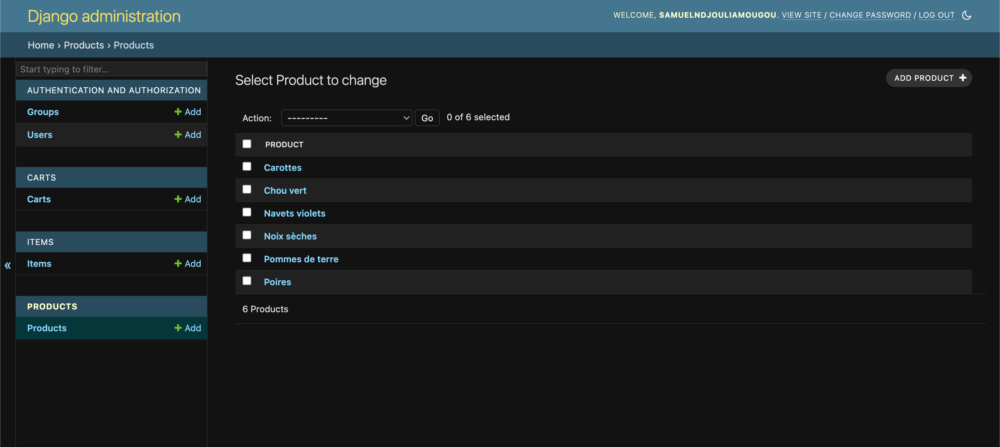

<h1 align=center>Kelbongoo - E-commerce App</h1>
<h2 align=center>E-Commerce Website with Django + React Tailwind CSS</h2>

### How to Run 🏃‍♀️

```shell
# 1. Clone the repository
git clone https://github.com/samuelndjouli997/kelbongoo-test-technique.git

[BACKEND]
# 2. Navigate to the project directory
cd backend

# 3. Set up a virtual environment
python -m venv env
#For MAC: source env/bin/activate  # For Windows: .\env\Scripts\activate

# 4. Install dependencies
pip install -r requirements.txt
npm install  # Inside the frontend directory

# 5. Apply migrations
python manage.py migrate

# 6. Run the development server
python manage.py runserver

[FRONTEND]
# 7. Navigate to the project directory
cd frontend
# 8. Install dependencies
npm i
# 9. Run the local server
npm run dev
```
### 📷 Project Screenshots





### 🚀 Project Features

A completely customized eCommerce / shopping cart application using Django, REACT with the following functionality:

<h2>Backend Models: Product</h2>

<h3>Fields:</h3>
<ul>
    <li>Product Name</li>
    <li>Price Excluding Tax (decimal with 2 decimal places)</li>
    <li>VAT (5.5% or 20%)</li>
    <li>Ordered Stock (positive integer)</li>
    <li>Maximum Available Stock (positive integer)</li>
</ul>

<h3>Methods:</h3>
<ul>
    <li>calculatePriceTTC: Calculates the VAT-inclusive price of a product.</li>
    <li>The remaining available stock of a product is updated after the checkout</li>
</ul>

<h2>Backend View: Inventory Input</h2>
<p>I create an admin view in Django to input product details, including a button to add the product.</p>
<p>On clicking the "Add" button, the product is saved with its parameters in the database.</p>

<h2>Backend Models: Cart and Item</h2>

<h3>Cart Model:</h3>
<ul>
    <li>ID</li>
    <li>Checked_out (boolean, becomes true upon order completion)</li>
</ul>

<h3>Item Model:</h3>
<ul>
    <li>Cart ID</li>
    <li>Product ID</li>
    <li>Quantity (positive integer)</li>
</ul>

<h3>Method:</h3>
<ul>
    <li>calculateTotalTTC: Calculates the total amount of the items in the cart, including VAT.</li>
</ul>

<h2>Frontend View: Product Catalog</h2>

<p>I created a view to list the created products.</p>

<h2>Real-time Cart Update</h2>

<p>Whenever the desired quantity field of a product is modified, it updates the item in the cart.</p>
<p>The field representing the total ordered amount is updated in real-time without page refresh.</p>


<h2>Order Placement</h2>

<p>I added a checkout button in the cart view</p>
<p>Upon clicking the checkout button, it marks the cart as "checked_out", it updates the total stock of products with the quantity ordered, and redirect the user to the catalog with a new empty cart.</p>

<p>PS: I couldn't manage to retain the cart data after the page reload. Something strange was happening with local storage. I tried several solutions, but I couldn't succeed.</p>
